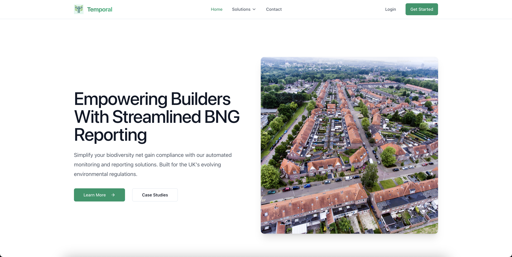
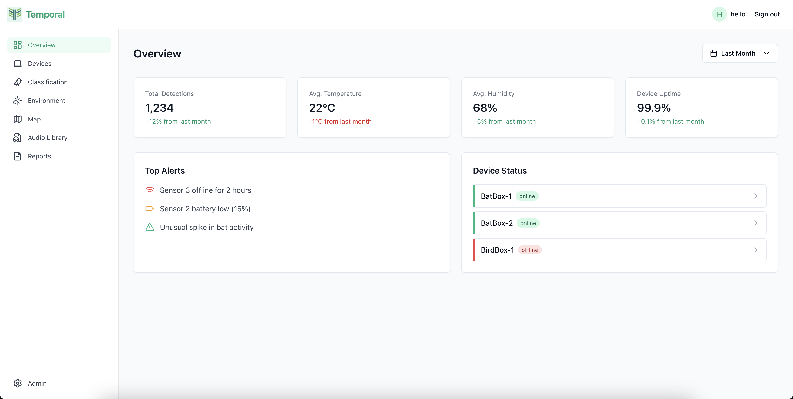
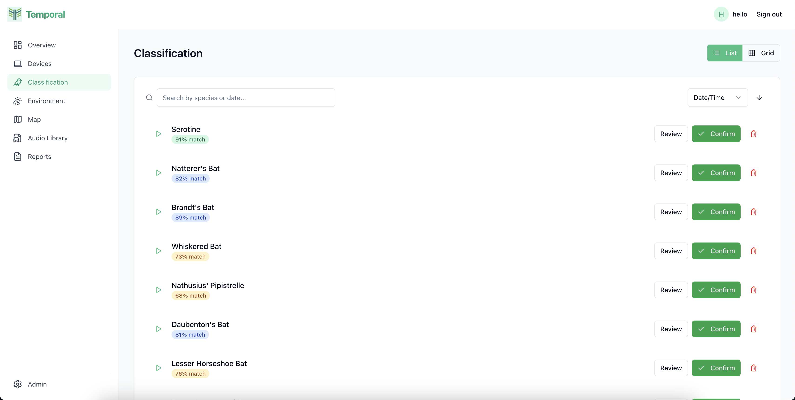
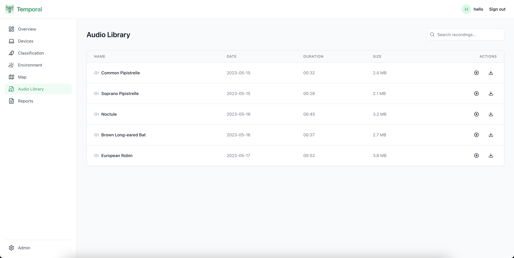
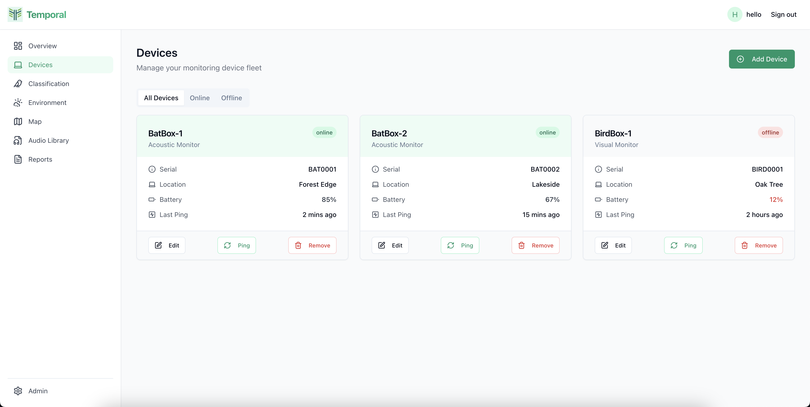

# Temporal - Ecology Compliance Platform 🦇 🌿

Temporal is a sophisticated environmental monitoring platform that helps developers, land managers, and ecologists track and analyze biodiversity data. Built with modern web technologies, it provides real-time habitat monitoring and automated compliance reporting for biodiversity net gain (BNG) requirements.

## 🌟 Features

### Public Features
- **Solutions for Multiple Stakeholders**
  - Developers: Construction & planning tools
  - Land Managers: Site management tools
  - Ecologists: Biodiversity assessment tools

- **Real-time Habitat Monitoring**
  - Live data collection from field sensors
  - Automated species detection
  - Environmental condition tracking

- **Compliance Reporting**
  - Automated BNG calculations
  - Regulatory compliance checks
  - Report generation and export

### Dashboard Features

Comprehensive dashboard providing real-time insights into environmental monitoring, device status, and species classification.

Key Dashboard Features:
- **Audio Classification**
  - AI-powered species identification
  - Waveform visualization
  - Manual verification interface

- **Environmental Monitoring**
  - Temperature and humidity tracking
  - Correlation analysis with wildlife activity
  - Historical data visualization

- **Device Management**
  - Real-time device status monitoring
  - Battery level tracking
  - Connection strength monitoring

## 🛠️ Technology Stack

- **Frontend**: React + TypeScript
- **Styling**: Tailwind CSS + shadcn/ui
- **Charts**: Recharts
- **State Management**: TanStack Query
- **Routing**: React Router
- **Authentication**: Supabase Auth
- **Database**: Supabase PostgreSQL
- **Real-time Updates**: Supabase Realtime

## 📸 Screenshots

### Public Pages

Modern and responsive landing page showcasing our environmental monitoring solutions.

### Dashboard

Intuitive dashboard with real-time environmental and device monitoring.

Advanced audio classification interface with AI-powered species identification.

Comprehensive audio library for managing and analyzing recorded wildlife sounds.

Real-time device monitoring and management interface.

---

*Note: This is a portfolio project demonstrating full-stack development capabilities using modern web technologies. The data shown in the screenshots is simulated for demonstration purposes.*
